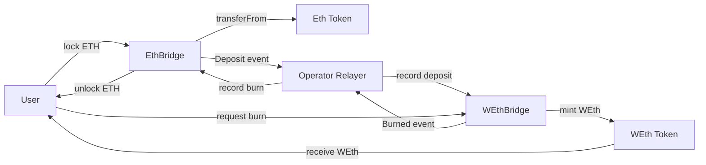

# ETH Bridge (One-Way)

Simple bridge prototype for EVM chains using Foundry.

This repository contains:
- `Eth` token on source side
- `WEth` token on destination side
- `EthBridge` to lock/release `Eth`
- `WEthBridge` to mint/burn `WEth`

The bridge is **owner-operated**. A relayer/operator (the contract owner) updates bridge records across chains.

## Architecture



## Contracts

| Contract | File | Purpose |
|---|---|---|
| Eth | `src/Eth.sol` | Source-chain ERC20 token with owner-only mint |
| WEth | `src/WEth.sol` | Destination-chain wrapped token with owner-only mint/burn |
| EthBridge | `src/EthBridge.sol` | Locks ETH token and unlocks after burn confirmation |
| WEthBridge | `src/WEthBridge.sol` | Mints WEth after lock confirmation and burns WEth for return flow |

## Bridge Flow

| Step | Source Side (`EthBridge`) | Destination Side (`WEthBridge`) |
|---|---|---|
| 1. Deposit | User approves + calls `lock(amount)` | - |
| 2. Observe | `Deposit(user, amount)` event emitted | Operator watches source event |
| 3. Credit | - | Operator calls `deopsitedOnOtherSide(user, amount)` |
| 4. Mint | - | Owner calls `mint(user, amount)` |
| 5. Return | Owner calls `burnedOnOtherSide(user, amount)` after burn event | Owner calls `burnFrom(user, amount)` emits `Burned` |
| 6. Unlock | User calls `unLock(amount)` | - |

## Main Functions

| Contract | Function | Access | Description |
|---|---|---|---|
| EthBridge | `lock(uint amount)` | Public | Locks user `Eth` into bridge contract |
| EthBridge | `burnedOnOtherSide(address from, uint amount)` | Owner | Credits user unlock balance after destination burn |
| EthBridge | `unLock(uint amount)` | Public | Releases locked `Eth` based on credited balance |
| WEthBridge | `deopsitedOnOtherSide(address from, uint amount)` | Owner | Credits mintable balance after source deposit |
| WEthBridge | `mint(address to, uint amount)` | Owner | Mints `WEth` using credited balance |
| WEthBridge | `burnFrom(address from, uint amount)` | Owner | Burns user `WEth` and emits burn event |

## Events

| Contract | Event | Meaning |
|---|---|---|
| EthBridge | `Deposit(address depositor, uint amount)` | User locked source-side tokens |
| WEthBridge | `Burned(address depositor, uint amount)` | User tokens burned on destination side |

## Trust Model and Limitations

This implementation is intentionally simple and has strong trust assumptions:
- Owner controls cross-chain state updates.
- No decentralized light client or proof verification.
- No slashing/challenge mechanism.
- No pause/rate-limit/emergency controls.

Use this as a learning prototype, not production-ready bridge infrastructure.

## Quickstart

Install dependencies:

```bash
forge install
npm install
```

Build:

```bash
forge build
```

Test:

```bash
forge test
```

## Project Structure

| Path | Description |
|---|---|
| `src/Eth.sol` | Source token |
| `src/WEth.sol` | Wrapped token |
| `src/EthBridge.sol` | Source-side bridge |
| `src/WEthBridge.sol` | Destination-side bridge |
| `test/Contract.t.sol` | Placeholder/default Foundry test file |